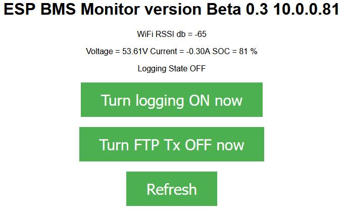
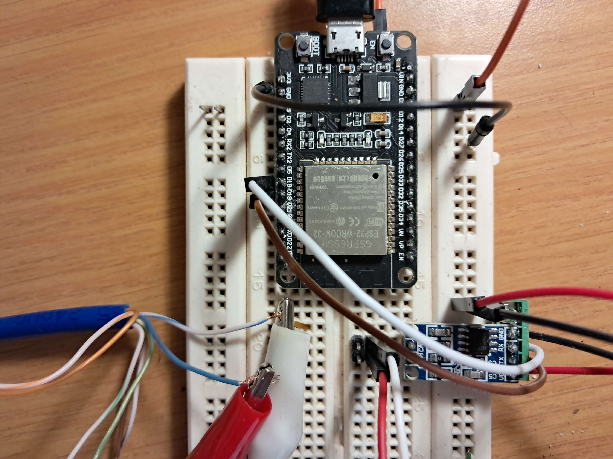
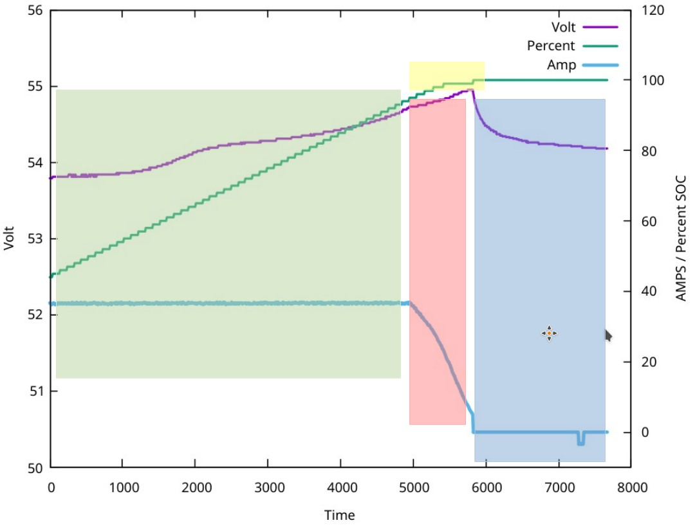

ESP32 BMSmonitor

The ESP32 BMSmonitor is used to monitor solar battery to inverter CAN bus with Pylon protocol.

# Detailed description
The BMSmonitor gather data on CAN and save it in a ".csv" file that can be send to a ftp server

# Preparation
*Hardware*
- Any ESP32 module or development board and any CAN line driver level-converter board.

*Software*
- Arduino IDE (1.8 or above)
- Arduino IDE ESP32 Board Installation

# Installation and Running

1. Open the BMSmonitor.ino Arduino sketch in Arduino IDE.
2. Edit defines, IP addresses and variables to fit your needs:
      #define WIFI_SSID "XXXXXXX"         // Insert your WiFi SSID and password here
      #define WIFI_PASS "XXXXXXX"
      IPAddress local_IP(10, 0, 0, 0);    // Insert your correct IP addresses in the following
      IPAddress gateway(10, 0, 0, 0);
      IPAddress subnet(255, 255, 0, 0);
      IPAddress primaryDNS(10, 0, 0, 0);
      IPAddress secondaryDNS(10, 0, 0, 0);
      char ftp_server[] = "10.0.0.XXX";   // Insert your ftp server IP here
      char ftp_user[]   = "XXXXXXX";      // Insert your ftp server username here
      char ftp_pass[]   = "XXXXX";        // Insert your ftp server password here

3. Compile ESP32_BLE_Scanner.ino Arduino sketch, and flash it to ESP32 board. 
   After flashing, you can connect to "local_IP" set above with any internet browser.

When you press "Turn Logging ON" the ESP32 wil start a new log file. When you press it again the loging wil stop.
Then you can press "Turn FTP TX ON" to transfer the file.

Connections:
    1) CAN-H (Blue wire (pin 4) on Ethernet cable) to CAN-H on CAN line driver board.
    2) CAN-L (Blue&White wire (pin 5) on Ethernet cable) to CAN-L on CAN line driver board.
    3) ESP32 Ground to Ground on CAN line driver board.
    4) ESP32 5V to VCC on CAN line driver board.
    5) ESP32 pin 19 to TX on CAN line driver board.
    6) ESP32 pin 18 to RX on CAN line driver board.
    7) ESP32 power from USB cable

This graph was obtained while charging my Enertec Megatank GL48100 battery from my Deye inverter at 36 Amps.
The ".csv" file was modified and ran through the gnuplot tool on Linux to get this graph. 
In the CAN packets I see a lot of zero's and some fields are just garbage data - is this normal?

1) The green shaded area is the Constant Current charging at 36 Amps where you see the SOC go up in a perfect straight line. The Voltage nearly flat with small bump at 70 % SOC – exactly like your curves. This look fine.
2) The pink shaded area is strange. Here the current drop logarithmicly to zero over about 10 min. This do not seem to me enough time at low current for balancing let alone for absorption. This look very funny to me.
3) The yellow shaded area just show how the SOC slowly creep up to 100% when the current drop slowly. This look fine.
4) The Blue area is just where the battery settle down after charging. Also look fine.

The pink area is not what I expected - See the graphs by Andy on "The Off-Grid Garage" : https://off-grid-garage.com/

Enertec refuse to give me the 25T or 15T set-up software after a big ugly fight (even the installers don’t get it!). 
See: https://enertec.co.za/couch/uploads/file/user-manuals/en230728-gl-t-how-to-make-gl48100-communicate-with-different-inverter-v1-031.pdf

Do anybody have this 25T or 15T software - please let me know where to find it.

